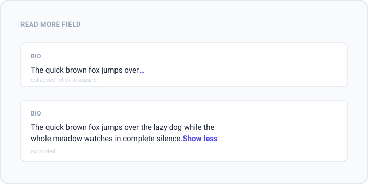

# Nova Read More Field

[](https://packagist.org/packages/mattsplat/readmore)
[](https://github.com/mattsplat/readmore/actions/workflows/code-style.yml)
[](https://packagist.org/packages/mattsplat/readmore)
[](LICENSE)

A Laravel Nova field that shortens long text and reveals the rest on click.
It truncates on the index and detail views (on a word boundary), and renders a
normal textarea on create / update forms.



> **Nova compatibility**
>
> | Package version | Nova     | PHP    |
> |-----------------|----------|--------|
> | `^2.0`          | `^4.0`   | `^8.0` |
> | `^1.0`          | `1.x`    | `>=7.1`|
>
> v2 is a rewrite for Nova 4 and **removes the `Text::readMore()` /
> `Textarea::showOnIndex()` macros** in favour of a dedicated field. See
> [UPGRADE.md](UPGRADE.md).

## Install

```bash
composer require mattsplat/readmore
```

## Usage

```php
use Mattsplat\Readmore\ReadMore;

ReadMore::make('Notes'),
```

By default the field shows on the index (unlike Nova's `Textarea`). Chain the
usual Nova methods to change that:

```php
ReadMore::make('Notes')->hideFromIndex(),
```

### Options

```php
ReadMore::make('Notes')
    ->characters(60)         // characters shown before truncating (default 20)
    ->mask('read more')      // the "reveal" indicator (default '...')
    ->lessLabel('collapse')  // the "collapse" control label (default 'Show less')
    ->rows(8),               // textarea rows on forms (default 5)
```

`mask()` accepts HTML, so you can use an icon instead of text:

```php
$icon = '<svg xmlns="http://www.w3.org/2000/svg" viewBox="0 0 24 24" width="16" height="16"><path d="M6 2h9a1 1 0 0 1 .7.3l4 4a1 1 0 0 1 .3.7v13a2 2 0 0 1-2 2H6a2 2 0 0 1-2-2V4c0-1.1.9-2 2-2z"/></svg>';

ReadMore::make('Notes')->characters(0)->mask($icon),
```

The reveal / collapse control is a real `<button>`: it is keyboard focusable,
toggles with <kbd>Enter</kbd> / <kbd>Space</kbd>, and exposes `aria-expanded`.

## Development

The `dist/` bundle is committed so the package works without a build step. To
recompile it from `resources/js`, run the build inside a Nova application
checkout (Nova's mix tooling is not on the public npm registry):

```bash
npm run nova:install
npm run prod
```

The bundle externalises `Vue` and `LaravelNova`, so it is a small (~4 KB) file
that relies on Nova's own runtime.

### Quality checks

```bash
composer install   # needs Nova credentials (see below)
composer test      # PHPUnit
composer lint      # Pint (code style)
composer analyse   # PHPStan / Larastan
```

`composer install` pulls `laravel/nova`, so you need Nova credentials
configured:

```bash
composer config --auth http-basic.nova.laravel.com "you@example.com" "your-license-key"
```

`composer lint` (Pint) needs no license and runs in CI on every push. The
`test` / `analyse` suite needs Nova, so it runs locally or on demand via the
`tests` workflow (Actions tab) once `NOVA_USERNAME` / `NOVA_LICENSE_KEY` secrets
are set.

See [CONTRIBUTING.md](CONTRIBUTING.md) for more.

## Credits

Inspired by [Index TextArea](https://github.com/dillingham/nova-index-textarea)
by [Brian Dillingham](https://novapackages.com/collaborators/dillingham).
